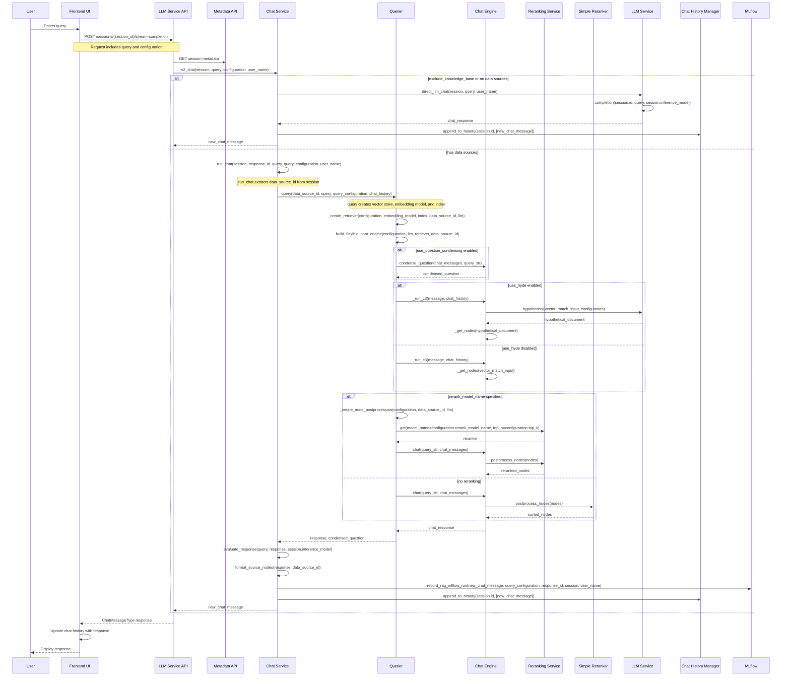

# RAG Studio

Build RAG-based chatbots on your data with Cloudera's RAG Studio.


## Table of Contents

- [Overview](#overview)
- [Customer Use Cases](#customer-use-cases)
- [Getting Started](#getting-started)
- [Quickstart Guide](#quickstart-guide)
  - [1) Open the App](#1-open-the-app)
  - [2) Create a Knowledge Base](#2-create-a-knowledge-base)
  - [3) Upload Documents](#3-upload-documents)
  - [4) Start a Chat](#4-start-a-chat)
  - [5) Tune Chat Settings](#5-tune-chat-settings-optional)
  - [6) Use Tools](#6-use-tools-beta-optional)
  - [7) Review Analytics](#7-review-analytics-optional)
  - [Troubleshooting](#troubleshooting)
- [Detailed UI Guide](#detailed-ui-guide)
  - [Navigation Overview](#navigation-overview)
  - [Configuration Check and Redirection](#configuration-check-and-redirection-cml--caii)
  - [Knowledge Bases](#knowledge-bases)
  - [Chats](#chats)
  - [Analytics](#analytics)
  - [Settings](#settings)
- [Advanced Features](#advanced-features)
  - [Semantic Visualization](#semantic-visualization)
  - [Automated Quality Alerts](#automated-quality-alerts)
  - [Question Rewriting](#question-rewriting)
- [HITL and Monitoring](#hitl-and-monitoring)
- [Why RAG Studio?](#why-rag-studio)
  - [Flexible](#flexible)
  - [Fast](#fast)
  - [Smart](#smart)
  - [Custom](#custom)
- [Advanced RAG Techniques](#advanced-rag-techniques)
  - [1. Metadata Augmented RAG](#1-metadata-augmented-rag-the-contextual-filter)
  - [2. O-RAG](#2-o-rag-ontologicalontology-grounded-rag)
  - [3. HyDE](#3-hyde-hypothetical-document-embeddings)
- [Technical Architecture](#technical-architecture)
- [Changelog](#changelog)
- [Conclusion](#conclusion)

## Overview

RAG Studio helps teams build retrieval-augmented chatbots on enterprise data with a guided, UI-first workflow. It provides:

- A single studio entry point to build RAG-based chatbots
- Seamless progression from knowledge base creation to chat interaction
- Support for both rapid prototyping and production-grade enterprise use cases

### Customer Use Cases


Most enterprise customers have teams that vary in technical expertise. RAG Studio addresses this by enabling:

- Non-technical users to build chatbots for various business needs
- ML teams to rapidly prototype and iterate on models
- Enterprises to deploy secure, scalable AI solutions on their own data

## Getting Started


RAG Studio provides a simple three-step workflow:

1. **Create Your Knowledge Base** - Set up the foundation for your chatbot by configuring how documents are processed and indexed
2. **Upload Your Documents** - Add content through drag-and-drop or API integration
3. **Ask Questions, Get Answers** - Start chatting immediately with AI-powered responses based on your data

---

## Quickstart Guide

This quickstart guide will walk you through setting up and using RAG Studio for the first time.

### 1) Open the App

Landing Page:


**Note on Configuration (CML + CAII):**

- If your CML deployment and CAII (Cloudera AI Inference) endpoints (LLM, Embeddings, Rerankers) are in the same environment, the app validates Studio configuration with CAII.
- If no valid configuration is detected, you will be redirected to Settings to configure the Studio.
- For a breakdown of each option, see [Studio Settings Configurations](#studio-settings-configurations) in the Detailed UI Guide.


### 2) Create a Knowledge Base

1. Go to **Knowledge Bases** and click **Create Knowledge Base**.
2. Fill in the required fields: Name, Chunk Size, Embedding Model.
3. Optional: Select a Summarization Model.
4. Click **Save**.


### 3) Upload Documents

1. Open the knowledge base and navigate to the **Manage** tab.
2. Drag-and-drop or select files, then click **Start Upload**.
3. Confirm the uploaded files appear in the table.

**Supported Document Formats:**

- **Documents**: PDF (`.pdf`), Word (`.docx`), Markdown (`.md`), Text (`.txt`), HTML (`.html`, with advanced PDF processing)
- **Spreadsheets**: Excel (`.xlsx`, `.xlsm`, `.xlsb`, `.xls`), OpenDocument (`.ods`), CSV (`.csv`)
- **Presentations**: PowerPoint (`.pptx`, `.pptm`)
- **Data**: JSON (`.json`)
- **Images**: JPEG (`.jpg`, `.jpeg`), PNG (`.png`)


### 4) Start a Chat

1. Go to **Chats**.
2. In the input box, type a question.
3. Send the message (**Enter** or click send). If no session exists, it will be created automatically on first send.
4. **Optional before sending:** Click **Chat Settings** to open the Create Session modal and preselect knowledge base(s) and response model.

**Tips:**

- Use the KB selector (when creating a new session) next to the input to pick knowledge bases.
- Use the model selector next to the input to choose the response model.
- Toggle the database icon to include or exclude the knowledge base per message.
- Use the stop icon to cancel streaming.
- Click suggested questions to continue the conversation.

**Suggested Questions:**

- If a session is created with no messages, you'll see Suggested Questions in the chat body (KB-aware when KBs are selected; default list if none).
- After you send a message, follow-up suggestions appear after the response.


### 5) Tune Chat Settings (Optional)

1. Click **Chat Settings** in the chat header.
2. Adjust: session name, knowledge bases, response model, rerank model, max docs, and advanced options (Tool Calling, HyDE, Summary Filter, Disable Streaming).
3. Click **Save**.


### 6) Use Tools (Beta, Optional)

- Enable **Tool Calling** from Chat Settings.
- If Tool Calling is enabled, click the wrench icon and select tools.
- Manage available tools in **Settings → Tools**.


### 7) Review Analytics (Optional)

1. Open **Analytics**.
2. Review App Metrics and Session Metrics.
3. Filter by model, reranker (or None), summary filter usage, HyDE, knowledge base usage, and project.


### Troubleshooting

- **No embedding models available** when creating a knowledge base → Configure models in **Settings → Model Configuration**.
- **Upload errors** → Check file size/type and retry.
- **Chat not using knowledge base** → Ensure the database icon is filled (included) or select KBs for the session.


---

## Detailed UI Guide

This section provides comprehensive guidance on using all features in RAG Studio's user interface.

### Navigation Overview

- **Chats**: Ask questions, manage sessions, upload files to the active chat, and control models/tools.
- **Knowledge Bases**: Create and manage knowledge bases, upload documents, and configure indexing.
- **Analytics**: Review app and session metrics with filters.
- **Settings**: Configure studio settings, models, and tools.


### Configuration Check and Redirection (CML + CAII)

- If the CML deployment and CAII (Cloudera AI Inference) endpoints for LLM, Embeddings, and/or Rerankers are in the same environment, the app validates Studio configuration with CAII.
- If there is no valid configuration, the app will redirect you to the Settings page to configure the Studio.


## Create a Knowledge Base


Knowledge bases are the foundation for retrieval and answering. When creating a new knowledge base, you configure:

### Core Settings

- **Name**: Identifier for your knowledge base (e.g., `COE`)
- **Chunk size (tokens)**: `512` (controls how documents are split)
- **Embedding model**: `Text Embedding Ada 002` (converts text to vector representations)
- **Summarization model**: `OpenAI GPT-4o` (generates summaries when needed)

### Advanced Options

- **Distance metric**: `Cosine` (for similarity search)
- **Chunk overlap**: `10%` (ensures context continuity between chunks)

### Knowledge Base Management


Key features:

- Any authorized user can create a knowledge base
- Configure details or customize models to suit your needs
- Choose between manual or automatic connection setup


Once created, you can:

- Drag and drop data for indexing with built-in and customizable vectorDB
- Add documents via CDF or API in real time
- Make new content available to chatbots instantly
- View document summaries and metadata

**Documents can be added via CDF or API in real time and made available to your chatbots instantly.**

#### Edit Knowledge Base Settings

1. Open a knowledge base and navigate to **Index Settings**.
2. Update fields such as name, models, availability, etc.
3. Click **Update** to save. You can also delete the knowledge base from this page.


#### Other Knowledge Base Tabs

- **Connections**: Configure external connectors (if applicable).
- **Metrics**: Knowledge base–level statistics.
- **Visualize**: Explore vector graph visualization.


---

## Chats

### Start a New Chat


Type a question and send. If no session exists, a new session is created automatically on your first send.

**Optional:** Before sending, click **Chat Settings** to open the Create Session modal and preselect knowledge base(s) and the response synthesizer model.


### Ask Questions

- Use the input box at the bottom. Press **Enter** to send; **Shift+Enter** inserts a newline.
- Click the send icon to submit.
- Click the stop icon to cancel a streaming response.
- If knowledge bases exist, the placeholder reads "Ask a question"; otherwise, it reads "Chat with the LLM".

### Input Controls and Quick Settings


- **Knowledge Base Selector**: When no session exists, pick one or more knowledge bases next to the input before sending the first message.
- **Inference Model Selector**: Choose the response model next to the input. If a session exists, this updates the session; if not, it's used for the new session.
- After a session is created:
  - **Tools** : When Tool Calling is enabled, click to open Tool Selection and enable/disable tools for the session.
  - **Include/Exclude Knowledge Base Toggle** : Per-message control to include or exclude knowledge base retrieval.
  - **Chat Documents** : Upload docs into the session to be used as context.
  - **Stop Streaming Button**: Appears while a response is streaming.

### Use Knowledge Bases in a Chat

- Toggle the database icon to include or exclude the knowledge base for the current message.


- For new sessions, you can optionally select knowledge base(s) next to the input before sending the first message.


### Inference Model Quick Switch

- Next to the input, change the model on the fly. If the new model supports tool calling, the session setting updates accordingly.


### Upload Documents to the Active Chat

- Drag files anywhere in the chat area; a drop overlay will appear. Drop to upload into the associated knowledge base for the session.
- Alternatively, open the **Documents** control (paperclip/folder icon) near the input to manage uploads.
- Supports the same document formats as knowledge base uploads (PDF, Word, Excel, PowerPoint, CSV, JSON, Markdown, Text, Images, and more).


### Suggested Questions and Sources

- **Empty Chat**: When a session exists with no messages, Suggested Questions cards appear in the chat body. They are generated from the selected knowledge base(s). If none are selected or available, a default starter list is shown.
- **After Messages**: Follow-up suggestions appear near the input, tailored to the current session. If no knowledge base is in use, a default list is shown.
- **Sources and Feedback**: Each answer shows citations ("Sources") and optional evaluations (e.g., relevance, faithfulness). Use the copy and rating/feedback controls under each answer.


### Chat Settings (Session-Level)

Click **Chat Settings** in the header to modify the active session:

- Rename session
- Select knowledge base(s)
- Choose response synthesizer model
- Optional reranking model
- Maximum number of documents
- Advanced options:
  - Tool Calling (beta)
  - HyDE
  - Summary-based filtering
  - Disable streaming


### Tools (Beta)

- If Tool Calling is enabled, click the wrench icon () to open Tool Selection. Check tools to enable them for the session.
- Available tools are managed in **Settings → Tools**.


---

## Analytics

Use the Analytics page to view:

- **App Metrics**: Overall usage and health metrics.
- **Session Metrics**: Filter by response model, rerank model (or None), summary filter usage, HyDE, knowledge base usage, and project.


---

## Settings

### Studio Settings Overview

- **Studio Settings**: Environment and studio configuration.


- **Model Configuration**: Manage embedding and LLM models used across the app.


- **Tools**: Enable and configure tools available for Tool Calling.


### Studio Settings Configurations

Use **Settings → Studio Settings** to configure the application. Some fields are only editable when there are no chats or knowledge bases.

#### Processing Settings

- **Enhanced PDF Processing**: Improves text extraction for PDFs; requires a GPU and at least 16 GB RAM. Disabled with a warning if resources are insufficient.

#### Metadata Database

- **Embedded (H2)**: Default metadata database.
- **External PostgreSQL**: Provide JDBC URL, Username, and Password. Use **Test Connection** to validate; success/failure indicators are shown inline.


#### File Storage

- **Project Filesystem (Local)**: Stores files in the project filesystem.
- **AWS S3**: Set Document Bucket Name and optional Bucket Prefix.
  - **Store Document Summaries in S3**: Toggle when summarization is enabled for knowledge bases.
  - **Store Chat History in S3**: Toggle to persist chat history in S3.


#### Vector Database

- **Qdrant**: Embedded Qdrant (default).
- **Cloudera Semantic Search (OpenSearch)**: Set Endpoint, Namespace (alphanumeric), optional Username/Password. Supported up to OpenSearch 2.19.3.


- **ChromaDB**: Set Host (URL or hostname), optional Port, Token, Tenant, Database. SSL is inferred from `https://` in the host.


#### Model Provider

Choose a provider (e.g., CAII, OpenAI, Azure, Bedrock). Credentials are set under Authentication.

- **CAII**

  - If there are no hosted CAII endpoints in the same environment, you can optionally provide one that has hosted endpoints along with the CDP Auth Token.

  

- **OpenAI**

  - **API Key**: Provide your OpenAI API Key for authentication.
  - **Base URL**: Optional custom base URL for OpenAI-compatible endpoints.

  

- **Azure OpenAI**

  - **API Key**: Your Azure OpenAI service API key.
  - **Endpoint**: The Azure OpenAI service endpoint URL.
  - **API Version**: The API version to use (e.g., 2024-02-01).

  

- **AWS Bedrock**

  - **Region**: AWS region where your Bedrock models are hosted.
  - Access credentials are configured in the Authentication section.

  

#### Authentication

- **AWS**: Region, Access Key ID, Secret Access Key (visible when using Bedrock/S3/Summary S3).
- **Azure**: Azure OpenAI Key (when Azure is selected).
- **OpenAI**: OpenAI API Key (when OpenAI is selected).
- **CAII**: CDP Auth Token may be required depending on the environment.

#### Applying Changes

- Click **Submit** to review and confirm. A restart modal will guide you through applying changes.


- If chats or knowledge bases exist, a warning will appear and certain settings are disabled until data is removed.


### Add Tools from the UI

1. Go to **Settings → Tools**.
2. Click **Add Tool**.
3. In the modal, provide:
   - **Internal Name** (alphanumeric and dashes)
   - **Display Name**
   - **Description** : (Recommended) Please a provide a few lines detailing the use of the tool as it helps the LLM understand how to use the tool
4. Choose **Tool Type**:

   - **Command-based**: Enter Command, optional Arguments (comma-separated), and add Environment Variables (key/value) as needed.
     - For example, to add Serper Search & Scrape MCP:
       ```
       Command: npx
       Arguments: -y, serper-search-scrape-mcp-server
       Environment Variables:
           - SERPER_API_KEY: your_api_key_here
       ```

   

   - **URL-based**: Enter one or more URLs (comma-separated). (Not recommended)

   

5. Click **Add**. The tool appears in the Available Tools table (you can delete it later).
6. To use a tool in chat, enable **Tool Calling** in Chat Settings, then click the wrench icon in the input bar and select the tool(s).

---

## Start Chatting Quickly


Users can start a new chat at any time. The chat creation flow allows you to:

- Select a knowledge base (e.g., `Animal Research`)
- Choose a response synthesizer model (e.g., `Llama 3.1 8B Instruct v1`)
- Pick a reranking model (e.g., `Cohere Rerank v3.5`)
- Configure the maximum number of documents to retrieve

### Powered by Your Knowledge Base


Once configured, your chatbot provides:

- Answers powered by your enterprise knowledge base
- Source citations showing which documents were used
- Intelligent responses based on the most relevant context

**All answers are grounded in your enterprise data, ensuring accuracy and compliance.**

## Advanced Features


RAG Studio goes beyond basic chat with powerful features:

### Semantic Visualization

- **3D Chunk Vector Projection**: Visualize the semantic distance between chunks to understand how your data is organized in vector space
- Helps identify gaps or redundancies in your knowledge base

### Automated Quality Alerts

- **Relevance scoring**: Automatically evaluates if retrieved documents match the question
- **Faithfulness scoring**: Checks if the generated answer is supported by source documents
- Powered by LLM-as-judge evaluation

### Question Rewriting

- **Suggested Questions**: Automatically generates related questions to help users explore topics
- Improves user experience by guiding them to relevant information faster
- Helps users refine vague queries into specific questions

## HITL and Monitoring


Built-in Human-in-the-Loop (HITL) and monitoring capabilities include:

### Automated Logging

- Faithfulness scores (LLM-as-judge evaluation)
- Relevance scores (measures retrieval quality)
- `max_score` - highest confidence score
- `source_nodes_count` - number of documents retrieved
- Response latency and token usage

### User Feedback

- Collect subjective ratings with thumbs up/down
- Track user satisfaction over time
- Identify problematic queries or low-quality responses

### Visualization

- View metrics directly in RAG Studio
- Export to monitoring AMP (Cloudera's Applied ML Prototypes)
- Create custom charts and dashboards for your team

## Why RAG Studio?

### Flexible


**Any document, any user**

- Powered by IBM's Docling, RAG Studio ingests images, PDFs, and most file types with sophisticated preprocessing
- Customize your entire document parsing pipeline with the Cloudera Platform → DIM → RAGStudio integration
- Built by ML Teams, Usable by Enterprises

### Fast

**Prototype or Hack**

- Non-technical team members can DIY a chatbot for any use case they can think of
- Machine learning teams with crowded backlogs can quickly prototype and iterate
- Try different models and chunking settings code-free

### Smart


**HyDE? O-RAG?**

- Built with bleeding-edge innovations such as metadata-augmented RAG
- Your enterprise chatbots get better as research evolves
- Implements modern techniques that improve retrieval accuracy

### Custom

**Your Models, Your DBs**

- Connect with your AI provider of choice or power with custom models for any task in the pipeline
- Served with CAII (Cloudera AI Inference)
- Full control over model selection and deployment

## Advanced RAG Techniques

In the rapidly shifting landscape of 2026, enterprise RAG (Retrieval-Augmented Generation) has moved far beyond simple vector search. Techniques like HyDE, O-RAG, and Metadata Augmented RAG are the "bleeding edge" tools that turn standard chatbots into high-precision knowledge engines. Here is how these techniques specifically improve retrieval accuracy.

### 1. Metadata Augmented RAG: The "Contextual Filter"

Standard RAG often retrieves a relevant-looking text chunk that lacks the necessary context to be useful (e.g., a "Page 4" chunk that refers to "the project" without naming which project).

**How it improves accuracy:**

- **Precision Filtering**: By tagging chunks with metadata like Document Type, Security Clearance, Effective Date, and Product Version, the system can pre-filter the search space. This prevents a 2024 policy from overriding a 2026 update.

- **Contextual Nuggets**: Modern systems use LLMs to "enrich" chunks with metadata before indexing. A chunk of text might have a hidden metadata field that summarizes the entire document it came from, giving the retriever "global" awareness while looking at "local" text.

- **Self-Improving Loops**: As research evolves, new metadata fields (like "Factuality Score" or "User Satisfaction") are added to existing data, allowing the chatbot to prioritize chunks that have historically led to successful answers.

### 2. O-RAG (Ontological/Ontology-Grounded RAG)

O-RAG addresses the "Understanding Gap." While vectors understand that "car" is similar to "vehicle," they don't inherently understand the hierarchical relationship between "Engine Component" and "Maintenance Protocol."

**How it improves accuracy:**

- **Conceptual Clarity**: O-RAG (often implemented as RAO-OR) uses a domain-specific Ontology (a map of concepts). It ensures that when a user asks about a "Tier 1 Incident," the retriever knows to pull documents specifically related to that legal or technical definition, not just any document containing the word "Tier."

- **Relationship Mapping**: Instead of just finding similar text, O-RAG can perform Multi-hop Reasoning. If you ask "How does the new regulation affect our shipping in Asia?", O-RAG follows the "Ontological Path" from Regulation → Geography → Logistics to gather a complete picture.

### 3. HyDE (Hypothetical Document Embeddings)

HyDE solves Query-Document Asymmetry. Users often ask short, vague questions, while documents contain long, technical answers. These "look" different to a computer.

**How it improves accuracy:**

- **The "Hallucination" Magnet**: HyDE asks an LLM to "imagine" what a perfect answer would look like. This hypothetical answer contains the technical jargon and sentence structure that exists in your real documents.

- **Alignment**: By searching for a document using another hypothetical document (instead of a question), you significantly increase the mathematical similarity (cosine similarity) between your search query and the target data.

---

## Technical Architecture

This section describes the technical architecture and flow of RAG Studio's chat system.

### Chat Flow Sequence

The following diagram illustrates the complete chat flow from user query to response generation:



---

## Changelog

### RAG Studio Changelog (release/1)

This changelog summarizes notable changes per tagged release from 1.0.0 through 1.31.0 on the release/1 branch.

#### Recent Releases

##### 1.31.0

- Added Excel (.xlsx) file support for document ingestion
- Enhanced indexing performance for tabular documents (CSV, Excel)
- Updated dependencies and internal improvements

##### 1.30.0

- Added ChromaDB support
- Multi-slide `.pptx` files are now fully ingested instead of just the first slide

##### 1.29.0

- Added `TEXT_TO_TEXT_GENERATION` model support as inference models
- Cleaned up model provider detection and environment handling
- Deprecated `/chat` endpoint in favor of `/stream-completion`

##### 1.28.1

- Emergency fixes and enhancements
- Pinned OpenSearch versions and added UI note; improved validation

##### 1.28.0

- Implemented download file link in UI
- Updated dependencies and added GPT-5 to OpenAI models
- Removed unused describeEndpoint fields

##### 1.27.0

- Aggregate maintenance updates (Mob/main)

##### 1.26.0

- Added script to restore the global summary index
- Improved CAII model discovery and pre-release fixes

##### 1.25.0

- Chat UI improvements
- Miscellaneous dependency updates and stability tweaks

##### 1.24.1

- Fixed handling of empty knowledge base in chat flows

##### 1.24.0

- Added ability to upload files directly to a chat session
- Reverted MLflow to 2.x and corrected run UUID key

##### 1.23.0

- Replaced crew with custom Tool Calling implementation
- Streaming chat cleanup and in-process Docling
- Saved artifacts in repository instead of release assets
- Added fake-streaming for non-streaming tool models; enabled tool calling by default for subset
- New Tools Manager UI

##### 1.22.2

- Hotfixes and dependency bumps

##### 1.22.1

- Fixed: Kill startup script if Python fails to start

##### 1.22.0

- Added OpenSearch (Cloudera Semantic Search) vector database support
- Added multi-knowledge base support in sessions
- Allowed canceling in-flight chat requests from UI
- Made data source IDs optional on create session; filtered unsupported Bedrock models

##### 1.21.0

- Added Tool Calling feature (initial release)

##### 1.20.0

- Added OpenAI support and model provider
- Cross-config fixes and base URL tweaks

##### 1.19.0

- Allowed providing a CDP token for CAII access

##### 1.18.0

- Added streaming responses in chat; copy-to-clipboard for answers
- Fixed config update logic and type fallbacks
- Removed Qdrant as a separate app; returned to single-app mode

#### Earlier Releases

For a complete list of all releases from 1.0.0 through 1.17.0, including detailed changes for Analytics, CAII integration, model provider support, and foundational features, please refer to the full changelog in the repository.

Key historical milestones include:

- **1.17.0**: Release version display, service URL handling improvements
- **1.16.0**: Qdrant support, S3 summary storage
- **1.15.0**: Analytics with Project ID filtering
- **1.14.0**: Combined Java/Python Swagger
- **1.13.0**: Pre-release polish
- **1.12.0**: KB-free chat sessions, Projects foundation
- **1.11.0**: CAII NVIDIA model preference
- **1.10.0**: Azure model provider, Bedrock ARN support
- **1.9.0**: Analytics and metrics dashboards
- **1.8.0**: CAII DeepSeek support, HyDE session options
- **1.7.0**: Reranking end-to-end
- **1.6.0**: Composability features
- **1.5.0**: Markdown responses, image handling
- **1.4.0**: CAII endpoint discovery, multiple embeddings
- **1.3.0**: CSV/JSON parsing, Docling PDF support
- **1.2.0**: Indexing service abstraction
- **1.1.0**: UI and backend refinements
- **1.0.0**: Initial GA release

---

## Conclusion

RAG Studio provides a comprehensive platform for building production-ready chatbots on enterprise data. With its user-friendly interface, advanced features, and support for cutting-edge RAG techniques, it empowers both technical and non-technical users to create intelligent, context-aware AI applications.

Whether you're prototyping a new use case or deploying at enterprise scale, RAG Studio offers the flexibility, speed, and intelligence needed for modern AI applications.
