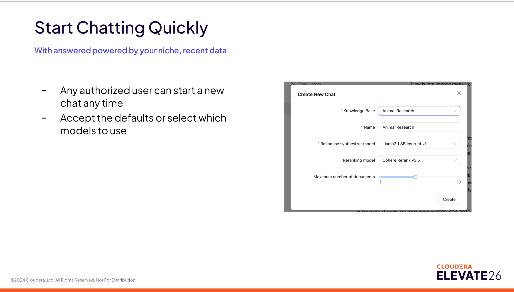
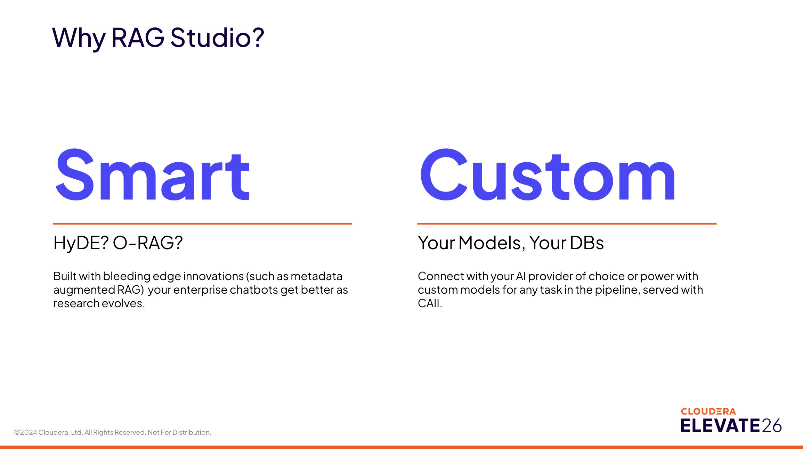

# RAG Studio

Build RAG-based chatbots on your data with Cloudera's RAG Studio.

## Overview

RAG Studio helps teams build retrieval-augmented chatbots on enterprise data with a guided, UI-first workflow. It provides:

- A single studio entry point to build RAG-based chatbots
- Seamless progression from knowledge base creation to chat interaction
- Support for both rapid prototyping and production-grade enterprise use cases

### Customer Use Cases

Most enterprise customers have teams that vary in technical expertise. RAG Studio addresses this by enabling:

- Non-technical users to build chatbots for various business needs
- ML teams to rapidly prototype and iterate on models
- Enterprises to deploy secure, scalable AI solutions on their own data

## Getting Started

RAG Studio provides a simple three-step workflow:

1. **Create Your Knowledge Base** - Set up the foundation for your chatbot by configuring how documents are processed and indexed
2. **Upload Your Documents** - Add content through drag-and-drop or API integration
3. **Ask Questions, Get Answers** - Start chatting immediately with AI-powered responses based on your data

## Create a Knowledge Base

Knowledge bases are the foundation for retrieval and answering. When creating a new knowledge base, you configure:

### Core Settings

- **Name**: Identifier for your knowledge base (e.g., `COE`)
- **Chunk size (tokens)**: `512` (controls how documents are split)
- **Embedding model**: `Text Embedding Ada 002` (converts text to vector representations)
- **Summarization model**: `OpenAI GPT-4o` (generates summaries when needed)

### Advanced Options

- **Distance metric**: `Cosine` (for similarity search)
- **Chunk overlap**: `10%` (ensures context continuity between chunks)

### Knowledge Base Management

Key features:

- Any authorized user can create a knowledge base
- Configure details or customize models to suit your needs
- Choose between manual or automatic connection setup

Once created, you can:

- Drag and drop data for indexing with built-in and customizable vectorDB
- Add documents via CDF or API in real time
- Make new content available to chatbots instantly
- View document summaries and metadata

**Documents can be added via CDF or API in real time and made available to your chatbots instantly.**

## Start Chatting Quickly

Users can start a new chat at any time. The chat creation flow allows you to:

- Select a knowledge base (e.g., `Animal Research`)
- Choose a response synthesizer model (e.g., `Llama 3.1 8B Instruct v1`)
- Pick a reranking model (e.g., `Cohere Rerank v3.5`)
- Configure the maximum number of documents to retrieve

### Powered by Your Knowledge Base

Once configured, your chatbot provides:

- Answers powered by your enterprise knowledge base
- Source citations showing which documents were used
- Intelligent responses based on the most relevant context

**All answers are grounded in your enterprise data, ensuring accuracy and compliance.**

## Advanced Features

RAG Studio goes beyond basic chat with powerful features:

### Semantic Visualization

- **3D Chunk Vector Projection**: Visualize the semantic distance between chunks to understand how your data is organized in vector space
- Helps identify gaps or redundancies in your knowledge base

### Automated Quality Alerts

- **Relevance scoring**: Automatically evaluates if retrieved documents match the question
- **Faithfulness scoring**: Checks if the generated answer is supported by source documents
- Powered by LLM-as-judge evaluation

### Question Rewriting

- **Suggested Questions**: Automatically generates related questions to help users explore topics
- Improves user experience by guiding them to relevant information faster
- Helps users refine vague queries into specific questions

## HITL and Monitoring

Built-in Human-in-the-Loop (HITL) and monitoring capabilities include:

### Automated Logging

- Faithfulness scores (LLM-as-judge evaluation)
- Relevance scores (measures retrieval quality)
- `max_score` - highest confidence score
- `source_nodes_count` - number of documents retrieved
- Response latency and token usage

### User Feedback

- Collect subjective ratings with thumbs up/down
- Track user satisfaction over time
- Identify problematic queries or low-quality responses

### Visualization

- View metrics directly in RAG Studio
- Export to monitoring AMP (Cloudera's Applied ML Prototypes)
- Create custom charts and dashboards for your team

## Why RAG Studio?

### Flexible

**Any document, any user**

- Powered by IBM's Docling, RAG Studio ingests images, PDFs, and most file types with sophisticated preprocessing
- Customize your entire document parsing pipeline with the Cloudera Platform → DIM → RAGStudio integration
- Built by ML Teams, Usable by Enterprises

### Fast

**Prototype or Hack**

- Non-technical team members can DIY a chatbot for any use case they can think of
- Machine learning teams with crowded backlogs can quickly prototype and iterate
- Try different models and chunking settings code-free

### Smart

**HyDE? O-RAG?**

- Built with bleeding-edge innovations such as metadata-augmented RAG
- Your enterprise chatbots get better as research evolves
- Implements modern techniques that improve retrieval accuracy

### Custom

**Your Models, Your DBs**

- Connect with your AI provider of choice or power with custom models for any task in the pipeline
- Served with CAII (Cloudera AI Inference)
- Full control over model selection and deployment

## Advanced RAG Techniques

In the rapidly shifting landscape of 2026, enterprise RAG (Retrieval-Augmented Generation) has moved far beyond simple vector search. Techniques like HyDE, O-RAG, and Metadata Augmented RAG are the "bleeding edge" tools that turn standard chatbots into high-precision knowledge engines. Here is how these techniques specifically improve retrieval accuracy.

### 1. Metadata Augmented RAG: The "Contextual Filter"

Standard RAG often retrieves a relevant-looking text chunk that lacks the necessary context to be useful (e.g., a "Page 4" chunk that refers to "the project" without naming which project).

**How it improves accuracy:**

- **Precision Filtering**: By tagging chunks with metadata like Document Type, Security Clearance, Effective Date, and Product Version, the system can pre-filter the search space. This prevents a 2024 policy from overriding a 2026 update.

- **Contextual Nuggets**: Modern systems use LLMs to "enrich" chunks with metadata before indexing. A chunk of text might have a hidden metadata field that summarizes the entire document it came from, giving the retriever "global" awareness while looking at "local" text.

- **Self-Improving Loops**: As research evolves, new metadata fields (like "Factuality Score" or "User Satisfaction") are added to existing data, allowing the chatbot to prioritize chunks that have historically led to successful answers.

### 2. O-RAG (Ontological/Ontology-Grounded RAG)

O-RAG addresses the "Understanding Gap." While vectors understand that "car" is similar to "vehicle," they don't inherently understand the hierarchical relationship between "Engine Component" and "Maintenance Protocol."

**How it improves accuracy:**

- **Conceptual Clarity**: O-RAG (often implemented as RAO-OR) uses a domain-specific Ontology (a map of concepts). It ensures that when a user asks about a "Tier 1 Incident," the retriever knows to pull documents specifically related to that legal or technical definition, not just any document containing the word "Tier."

- **Relationship Mapping**: Instead of just finding similar text, O-RAG can perform Multi-hop Reasoning. If you ask "How does the new regulation affect our shipping in Asia?", O-RAG follows the "Ontological Path" from Regulation → Geography → Logistics to gather a complete picture.

### 3. HyDE (Hypothetical Document Embeddings)

HyDE solves Query-Document Asymmetry. Users often ask short, vague questions, while documents contain long, technical answers. These "look" different to a computer.

**How it improves accuracy:**

- **The "Hallucination" Magnet**: HyDE asks an LLM to "imagine" what a perfect answer would look like. This hypothetical answer contains the technical jargon and sentence structure that exists in your real documents.

- **Alignment**: By searching for a document using another hypothetical document (instead of a question), you significantly increase the mathematical similarity (cosine similarity) between your search query and the target data.

## Conclusion

RAG Studio provides a comprehensive platform for building production-ready chatbots on enterprise data. With its user-friendly interface, advanced features, and support for cutting-edge RAG techniques, it empowers both technical and non-technical users to create intelligent, context-aware AI applications.

Whether you're prototyping a new use case or deploying at enterprise scale, RAG Studio offers the flexibility, speed, and intelligence needed for modern AI applications.
